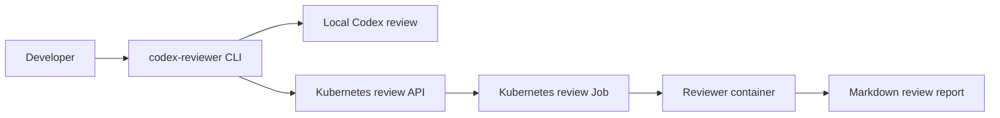
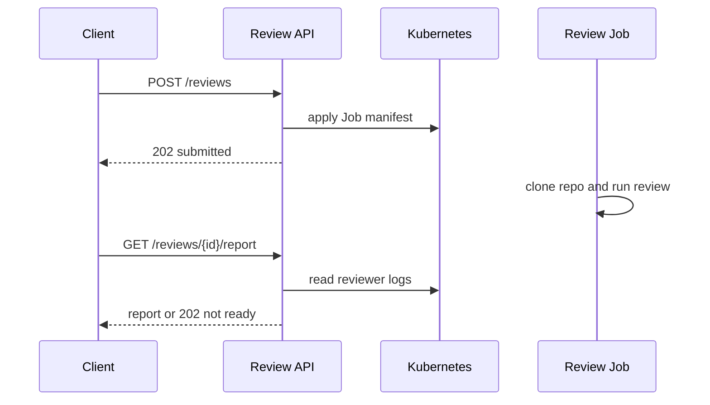

# Documentation

- [Code review checklist](code_review.md)
- [Docker and GHCR local review](docker-ghcr.md)
- [Kind E2E review test](kind-e2e.md)
- [Phase 1 Kubernetes review service plan](phase1-k8s-review-service-plan.md)
- [Sources](sources.md)

## System Flow

## Review Service Request Flow

